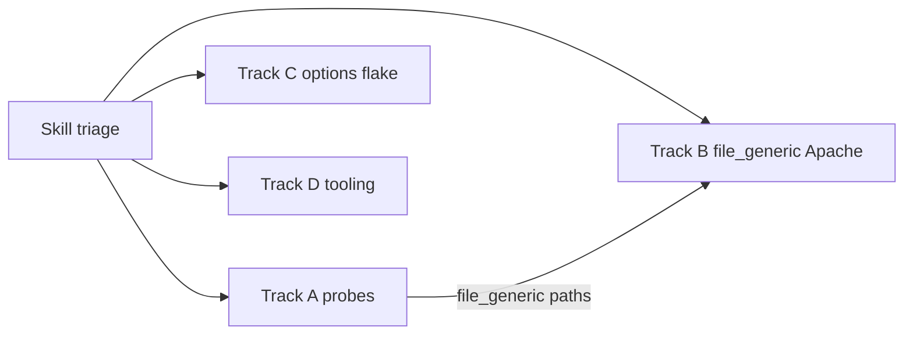

# W3TCQA failure fix — parallel implementation plans

These plans split work for **multiple agents** after triage with [SKILL.md](SKILL.md). Each track is independently mergeable; run full matrix or targeted specs before declaring done.

**Baseline context (release-2.10.0 AWS run):** ~2,531 failing environment runs concentrated in nine spec families; footer-based page-cache specs pass on the same boxes while `qa/plugins/*` backend probes fail.

---

## Track A — QA backend cache probes (primary)

**Owner focus:** `qa/plugins/` + optional shared helper  
**Failure specs:** `pagecache/basic`, `flush`, `frontpage`, `frontpage-debug`, `skip-flush-of-aloof-plugins`, `browsercache/compression`, `generic/user-agent-groups`, parts of `pagecache/frontpage-late-init`  
**Engines:** all (`file`, `file_generic`, `redis`, `memcached`, `apc`)

### Problem

Probe scripts compute cache keys with `md5(host + path)` (+ `_ssl`, UA suffix). PgCache stores under `_get_page_key()` which may differ (query string, normalization, `useragent`/`cookie`/`compression` extensions, filters). Browser footer tests prove entries exist and HITs work.

### Deliverables

1. **Shared key helper** (choose one):
   - **A1:** New `qa/plugins/pagecache-key.php` — accepts `url`, `engine`, optional extension overrides; returns JSON `{ page_key, page_group, enhanced_path? }` using `Dispatcher::component('PgCache_ContentGrabber')` internals or a small package-visible helper added to plugin for QA only.
   - **A2:** Extend each probe to duplicate `_get_page_key` algorithm (higher drift risk; avoid if A1 is acceptable).

2. **Update probes:**
   - `qa/plugins/cache-entry.php` — use real key + group for `Cache_*->get()`; fix `file_generic` path to match `pageCacheFileGenericUrlToFilename` / `_get_page_key_urlpart` enhanced rules.
   - `qa/plugins/browsercache/compression.php` — same for plain/gzip existence checks.
   - `qa/plugins/generic/user-agent-groups.php` — UA group suffixes via `Mobile_UserAgent` config or key helper with `useragent` extension.

3. **Tests / validation:**
   - Re-run on one box: `pagecache/basic`, `browsercache/compression`, `generic/user-agent-groups` × all engines.
   - Confirm `pagecache/cache-hit-single-footer` still passes (no regression).

### Acceptance criteria

- `pagecache-basic@blog-0-pagecache-file.log` shows `Page Caching using Disk` from probe after first homepage visit.
- `compression.php` returns `plain found` when browsercache compression disabled and pgcache enabled.
- `user-agent-groups.php` returns `ok` after two UA visits.

### Out of scope for Track A

- Apache rewrite / `w3tc_php` (Track B)
- `generic/options` box corruption (Track C)

### Agent prompt seed

```
Read .claude/skills/analyze-w3tcqa-environment/SKILL.md.
Implement Track A: align qa/plugins cache probes with PgCache_ContentGrabber page keys.
Start by reading PgCache_ContentGrabber::_get_page_key and qa/plugins/cache-entry.php.
Prefer a small qa/plugins/pagecache-key.php helper over duplicating key logic in three files.
Do not bump plugin version. Add @since 2.10.0 on new doc blocks only.
```

---

## Track B — Disk Enhanced (`file_generic`) on Apache

**Owner focus:** rewrite rules + enhanced disk paths  
**Failure specs:** `pagecache/accept-qs` (primarily `file_generic`); possibly `file_generic` rows in other specs  
**Boxes:** Apache-heavy (`apache-php74-*`, `apache-php85-*`)

### Problem

`accept-qs` logs show `w3tc_php: executed` — PHP handled request instead of static enhanced file. `cache-entry.php` may look for `page_enhanced/wp.sandbox/_index_slash.html` while nothing exists or path differs.

### Deliverables

1. **Reproduce on one Apache box:** enable `file_generic`, visit homepage, list `wp-content/cache/page_enhanced/`, inspect `.htaccess` / `web.config` fragments from `PgCache_Environment`.

2. **Fix root cause** (likely one of):
   - Rewrite rules not applied or overwritten after `setOptions` on Apache (`sys.afterRulesChange` no-op for Apache — may need explicit reload or rule ordering fix).
   - Enhanced files not created (`_can_write_cache` reject, enhanced mode guards).
   - QA probe path wrong (coordinate with Track A for `file_generic` branch).

3. **Validation:** `pagecache/accept-qs` + `pagecache/basic` with `file_generic` on `apache-php74-wp69-single`.

### Acceptance criteria

- Second homepage request: no `w3tc_php: executed` when rules should serve disk.
- Enhanced HTML file exists at expected path after first visit.

### Agent prompt seed

```
Read .claude/skills/analyze-w3tcqa-environment/SKILL.md Track B.
Investigate file_generic on Apache: accept-qs w3tc_php header, page_enhanced paths, PgCache_Environment rewrite output.
Coordinate with Track A for cache-entry file_generic path logic — do not duplicate conflicting path builders.
```

---

## Track C — `generic/options` isolated failure

**Owner focus:** box stability under repeated engine toggles  
**Failure:** single cell `apache-php85-https-wp70-subdomain` / `blog-2-cache-redis` (not matrix-wide)

### Problem

Mid-spec after multiple `setOptions` rounds: `Dispatcher not found` in `db.php`, broken `advanced-cache.php`, MySQL errors, HTTP connection refused.

### Deliverables

1. Read full `generic-options@blog-2-cache-redis.log` from CI bundle.
2. Determine if `restore-final` should run between permutations inside `options.js` or if drop-in mount (`w3tc-mount.sh`) races with admin saves.
3. Fix: test harness change **or** `restore-final` / mount hardening — minimal scope.

### Acceptance criteria

- `generic/options` passes on `apache-php85-https-wp70-subdomain` / `blog-2-cache-redis` in a full matrix re-run.

### Agent prompt seed

```
Read .claude/skills/analyze-w3tcqa-environment/SKILL.md Track C.
Triage generic/options failure on apache-php85-https-wp70-subdomain blog-2-cache-redis only.
Log shows db.php Dispatcher fatal then connection refused — distinguish test bug vs env flake.
```

---

## Track D — Triage tooling (optional, parallel)

**Owner focus:** skill-adjacent scripts in `qa/env/` or `.claude/skills/analyze-w3tcqa-environment/scripts/`

### Deliverables

1. `scripts/summary-spec-counts.rb` — parse `summary.html`, output markdown table: spec → failure count.
2. `scripts/compare-pass-fail.sh` — given spec + box, list pass/fail siblings from `reports-by-test/`.
3. Document commands in REFERENCE.md (no change to SKILL.md workflow unless verified).

Low risk; can run in parallel with A/B/C.

---

## Dependency graph



- **Track A** should land first or include `file_generic` path fix agreed with Track B.
- **Track C** is independent.
- **Track D** is independent.

---

## Verification matrix (after merges)

| Spec | Min boxes to re-run |
|------|---------------------|
| `pagecache/basic` | `apache-php74-wp69-single`, one nginx box |
| `browsercache/compression` | same |
| `generic/user-agent-groups` | same |
| `pagecache/accept-qs` | `apache-php74-wp69-single` `file_generic` only |
| `generic/options` | `apache-php85-https-wp70-subdomain` |

Full matrix: `./400-run-tests` on orchestrator (or `dev-box-start` for single-box dev).

---

## PR strategy

| Track | Suggested PR scope |
|-------|-------------------|
| A | Single PR: `qa/plugins/*` + optional `qa/plugins/pagecache-key.php` |
| B | Plugin `PgCache_Environment` / Apache template OR qa env script — keep separate if plugin change required |
| C | `qa/tests/generic/options.js` or `restore-final` / mount script |
| D | Tooling only under skill or `qa/env/scripts/` |

Reference GitHub issue per AGENTS.md contribution process.
