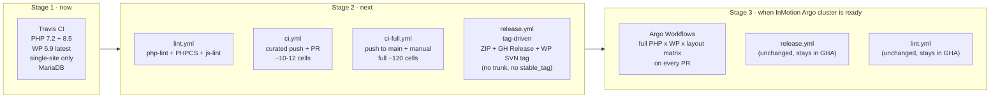
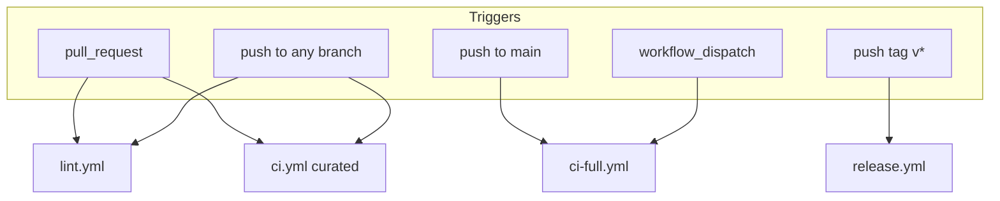
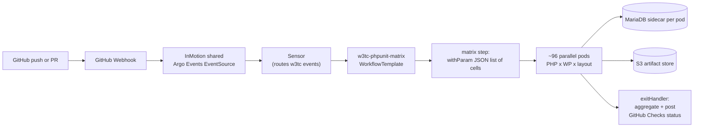

# Three-Stage CI Migration: Travis → GitHub Actions → Argo Workflows

## Migration overview



End state: CI matrix runs on InMotion's self-hosted Argo Workflows cluster; lint and release stay in GitHub Actions; Travis is gone.

## Test matrix dimensions

The intent is the same matrix on all three runners, scaled to what each runner can carry.

| Dimension | Values | Notes |
| --- | --- | --- |
| PHP | 7.2, 7.4, 8.0, 8.1, 8.2, 8.3, 8.4, 8.5 | 8 versions; 8.5 is RC/early-GA |
| WordPress | 6.8, 6.9, latest RC | 3 versions when an RC exists, 2 when it doesn't. RC slot is dynamic (currently 7.0-RC3); when no RC is published the RC dimension is dropped from the matrix entirely. |
| Install layout | single-normal, single-own-dir, ms-subdomain, ms-subfolder | 4 layouts: single-site at root, single-site with WordPress in its own directory (`siteurl != home`), multisite subdomain, multisite subfolder. |
| Database | MariaDB 11.4 LTS | Replaces `mysql:5.7` everywhere. WordPress 6.x requires MySQL 5.7+ or MariaDB 10.4+. |

Full cartesian: 8 x 3 x 4 = **96 cells** (or 64 when no RC). Each runner samples this differently:

- **Travis (Stage 1)**: 2 cells — PHP 7.2 and PHP 8.5, both on WP 6.9 + single-normal. Constrained by the 2-concurrent-job plan.
- **GH Actions push/PR `ci.yml` (Stage 2)**: 8 cells — PHP 7.2 + 8.5 x all 4 layouts x WP 6.9, for fast feedback on every push and PR.
- **GH Actions full `ci-full.yml` (Stage 2)**: 96 cells (64 without RC) on push to `main` plus manual `workflow_dispatch`. No schedule — push-driven only.
- **Argo (Stage 3)**: full 96 (or 64) on every push (cluster capacity permitting).

Adjust freely based on real runner minutes once we have data.

## Prerequisites (apply once, benefits every stage)

These changes land in PR 1 and unblock PHP 8.5 + multisite + MariaDB on every runner.

### composer.json widening

Three pins block PHP 8.5 today:

- `composer.json` line 8 — `"php": ">=7.2.5 <8.4"` — composer install fails on 8.4/8.5.
- `composer.json` line 20 — `"phpunit/phpunit": "^8.5"` — PHPUnit 8 supports up to PHP 8.1; running on 8.4/8.5 needs PHPUnit 9 or 10.
- `composer.json` line 45 — `"platform": { "php": "7.2.5" }` — intentional, stays.

Recommended changes:

- Widen `require.php` to `">=7.2.5 <8.6"` so composer install succeeds on 8.5 without `--ignore-platform-req`.
- Bump `require-dev.phpunit/phpunit` to `"^8.5 || ^9.6"`. PHPUnit 9.6 is the last line that supports PHP 7.2 transitively through `yoast/phpunit-polyfills` (already a dep at ^3.0). On PHP 7.2 composer resolves to PHPUnit 8.5; on PHP 8.2+ it resolves to PHPUnit 9.6.
- Leave `platform.php = 7.2.5`.
- Commit a regenerated `composer.lock` in the same PR.

Pinned dep note: `aws/aws-sdk-php: <3.368.0` (line 9) is pinned for PHP 7.2 compatibility. It installs on PHP 8.x; verify it loads on 8.5 during Stage 1.

### phpunit.xml modernization

The existing [phpunit.xml](phpunit.xml) was written for PHPUnit 8.x. PHPUnit 9.6 still accepts it but emits deprecation warnings. Update in the same PR:

- Line 2 — remove `convertErrorsToExceptions`, `convertNoticesToExceptions`, `convertWarningsToExceptions` (PHPUnit 9+ defaults convert to exceptions).
- Lines 11–19 — replace the `<filter><whitelist>` block with `<coverage><include>/<exclude>`:

```xml
<coverage>
    <include>
        <directory suffix=".php">./</directory>
    </include>
    <exclude>
        <directory>node_modules</directory>
        <directory>qa</directory>
        <directory>vendor</directory>
    </exclude>
</coverage>
```

- Line 9 — remove the `<logging><log type="coverage-clover">` block; `--coverage-clover=coverage.xml` on the CLI handles output.

Same `phpunit.xml` works for PHPUnit 8.5 (PHP 7.2 job) and 9.6 (newer PHP).

### `tests/bootstrap.php` multisite support

The current [tests/bootstrap.php](tests/bootstrap.php) doesn't handle multisite. To support all five install layouts from a single bootstrap, honor two env vars set by the CI layer:

- `WP_TESTS_MULTISITE=1` — defines `WP_TESTS_MULTISITE` constant so the WP core test bootstrap loads multisite scaffolding.
- `WP_TESTS_NETWORK_TYPE=subdomain|subfolder` — set in `wp-tests-config.php` via `define( 'SUBDOMAIN_INSTALL', true|false )`.

For the four locked-in layouts:

| Layout key | Env setup | Notes |
| --- | --- | --- |
| `single-normal` | (none) | WordPress at site root. Baseline. |
| `single-own-dir` | `WP_TESTS_HOME=https://example.org/`, `WP_TESTS_SITEURL=https://example.org/wp/` | WordPress installed in its own subdirectory; `siteurl != home`. |
| `ms-subdomain` | `WP_TESTS_MULTISITE=1`, `WP_TESTS_NETWORK_TYPE=subdomain` | Multisite with `SUBDOMAIN_INSTALL=true`. |
| `ms-subfolder` | `WP_TESTS_MULTISITE=1`, `WP_TESTS_NETWORK_TYPE=subfolder` | Multisite with `SUBDOMAIN_INSTALL=false`. |

Add a small `_w3tc_configure_install_layout()` helper above `_manually_load_plugin` that reads these env vars and patches `$_SERVER['HTTP_HOST']`, `WP_TESTS_DOMAIN`, the `SUBDOMAIN_INSTALL` constant, and `siteurl`/`home` options accordingly.

### `bin/install-wp-tests.sh` invocations in CI

The script already accepts `<wp-version>` as its 5th positional arg and `[skip-database-creation]` as its 6th. CI just needs to pass the right values per matrix cell:

```bash
bash bin/install-wp-tests.sh wordpress_test root '' 127.0.0.1:3306 6.9
```

For RC versions the script's `else` branch fetches the latest stable, so RC support requires a small enhancement: accept `7.0-RC3`-style strings and resolve them to the matching `develop.svn.wordpress.org` tag (or `branches/`).

## Stage 1 — Travis: add PHP 8.5, drop 8.3 (immediate)

Smallest viable change. Fits the 2-concurrent-job Travis plan.

- Keep the PHP 7.2 / `dist: bionic` entry unchanged. It still owns:
  - Coverage upload to Codecov (`coverage.xml`)
  - `bin/release.sh` deploy (WP.org SVN sync via `@boldgrid/wordpress-tag-sync`)
  - GitHub Releases attach of `w3-total-cache.zip`
- Replace the PHP 8.3 / `dist: jammy` entry with PHP 8.5 via `ondrej/php` PPA:

```yaml
- sudo add-apt-repository -y ppa:ondrej/php
- sudo apt-get update
- sudo apt-get install -y php8.5 php8.5-cli php8.5-mbstring php8.5-xml php8.5-curl php8.5-mysql php8.5-zip
- sudo update-alternatives --set php /usr/bin/php8.5
```

- Replace `services: - mysql` with MariaDB. On Travis bionic/jammy, install MariaDB 11.4 from the upstream MariaDB apt repo in `before_install`:

```yaml
- curl -LsS https://r.mariadb.com/downloads/mariadb_repo_setup | sudo bash -s -- --mariadb-server-version=11.4
- sudo apt-get update && sudo apt-get install -y mariadb-server
- sudo systemctl start mariadb
```

- Both jobs run WP 6.9 + single-site normal only. The 2-job budget can't afford more.
- Existing `script:` block unchanged — the `${TRAVIS_PHP_VERSION:0:3} == "7.2"` guard still gates coverage and deploys.

Fallback: if `ondrej/php` lags on 8.5 when PR 1 lands, use `php: nightly` (Travis nightly currently tracks 8.5).

## Stage 1.5 — Lint cleanup pre-work

The two PRs in this stage are auto-fix sweeps that make Stage 2's lint enforcement land green from day one. Neither changes any feature behavior; both should be code-review-light (focused on confirming the auto-fixer didn't break anything).

### PR 1.5a — PHPCS auto-fix + `phpcs-changed` setup

- Run `vendor/bin/phpcbf --standard=phpcs.xml .` once locally. It will auto-fix whitespace, yoda conditions, trailing commas, alignment, and other formatting issues that the WordPress ruleset enforces.
- Run the full PHPUnit suite after to confirm no auto-fix introduced a regression. (Auto-fixes can occasionally affect heredoc formatting or regex strings.)
- Commit the resulting diff (likely large — hundreds of touched files, mostly whitespace).
- Add `sirbrillig/phpcs-changed` to `composer.json` `require-dev`. Regenerate `composer.lock`.
- No PHPCS CI enforcement yet — that comes in PR 2 (`lint.yml`).
- **Expected diff size**: very large but mostly mechanical. Reviewers should focus on any non-whitespace changes.

### PR 1.5b — JS auto-fix sweep

- Run `yarn run js-lint-fix` (`prettier-eslint --write`) over the full tree.
- Manually review the diff for any cases where the auto-fixer altered semantics (rare; prettier is conservative).
- Commit.
- No JS-lint CI enforcement yet — that comes in PR 2 (`lint.yml`).
- **Expected diff size**: medium. Whitespace, quote normalization, semicolons, trailing commas.

After both PRs land, PR 2's `lint.yml` can enable PHPCS (via `phpcs-changed`) and JS-lint (full tree) as blocking checks without flooding new PRs with grandfathered failures.

## Stage 2 — GitHub Actions

Four workflows under `.github/workflows/`. Split keeps lint feedback fast, isolates failure modes, and lets us evolve each piece independently.

### Workflow layout



No scheduled triggers anywhere. CI fires only on Git activity (push, PR, tag) and manual dispatch.

### `lint.yml` (push + pull_request, fast)

Three independent jobs running in parallel. All three block merge via branch protection.

- **`php-lint`**: single job, PHP 8.3, runs `yarn run php-lint` (the existing `find ... php -lf` syntax check). ~1 min.
- **`phpcs`**: single job, PHP 8.3, runs `vendor/bin/phpcs-changed --git --git-base=origin/${{ github.base_ref || 'main' }}` so only lines changed in the PR are sniffed. New violations block; existing violations on unchanged code are ignored. Adds `sirbrillig/phpcs-changed` to `require-dev` in PR 1.5a. ~1-2 min depending on PR size.
- **`js-lint`**: single job, Node 20, runs `yarn run js-lint` (`prettier-eslint --list-different`) over the full tree. Blocking. After PR 1.5b's auto-fix sweep, the tree is clean and stays clean. ~1 min.

All three use `actions/cache@v4` for `~/.composer/cache` and `~/.cache/yarn` keyed on lockfile hashes.

### `ci.yml` (push + pull_request, curated matrix)

Fast feedback on every push and PR. Curated subset of the full matrix.

- Triggers:

```yaml
on:
  push:
    branches: ['**']
    tags-ignore: ['**']      # tags handled by release.yml; do not run CI matrix on tag push
  pull_request:
```

- `runs-on: ubuntu-latest`
- `concurrency: { group: ci-${{ github.ref }}, cancel-in-progress: true }` — kill stale runs when a branch pushes new commits.
- `strategy.fail-fast: false`
- Matrix (use `include:` for an explicit curated list rather than full cartesian):

```yaml
strategy:
  matrix:
    include:
      # PHP endpoints x all 4 install layouts on WP 6.9 = 8 cells
      - { php: '7.2', wp: '6.9', layout: 'single-normal' }
      - { php: '7.2', wp: '6.9', layout: 'single-own-dir' }
      - { php: '7.2', wp: '6.9', layout: 'ms-subdomain' }
      - { php: '7.2', wp: '6.9', layout: 'ms-subfolder' }
      - { php: '8.5', wp: '6.9', layout: 'single-normal' }
      - { php: '8.5', wp: '6.9', layout: 'single-own-dir' }
      - { php: '8.5', wp: '6.9', layout: 'ms-subdomain' }
      - { php: '8.5', wp: '6.9', layout: 'ms-subfolder' }
```

- Services:

```yaml
services:
  mariadb:
    image: mariadb:11.4
    env:
      MARIADB_ALLOW_EMPTY_ROOT_PASSWORD: "yes"
      MARIADB_DATABASE: wordpress_test
    ports:
      - 3306:3306
    options: >-
      --health-cmd="mariadb-admin ping -uroot"
      --health-interval=10s --health-timeout=5s --health-retries=5
```

- Steps:
  - `actions/checkout@v4`
  - `shivammathur/setup-php@v2` with `php-version: ${{ matrix.php }}`, `coverage: ${{ matrix.php == '7.2' && matrix.layout == 'single-normal' && 'xdebug' || 'none' }}`, `tools: composer:v2`, `extensions: mbstring, xml, curl, mysqli, zip`
  - `actions/setup-node@v4` with `node-version: 20`
  - `actions/cache@v4` for `~/.composer/cache`, `~/.cache/yarn`, and `/tmp/wordpress-tests-lib` keyed on `composer.lock`, `yarn.lock`, and the WP version
  - `yarn run install:deps`
  - `bash bin/install-wp-tests.sh wordpress_test root '' 127.0.0.1:3306 ${{ matrix.wp }}` with `WP_TESTS_MULTISITE` / `WP_TESTS_NETWORK_TYPE` env vars set per layout (small inline shell block, or extract to a `bin/ci-prepare.sh` helper)
  - PHPUnit: on the single coverage cell, `vendor/bin/phpunit --coverage-clover=coverage.xml`; otherwise `vendor/bin/phpunit`
  - `codecov/codecov-action@v4` with `files: coverage.xml`, `token: ${{ secrets.CODECOV_TOKEN }}`, `fail_ci_if_error: false` (report-only — coverage drops do not fail PRs), gated `if: matrix.php == '7.2' && matrix.layout == 'single-normal'`
  - Slack notify on failure: `slackapi/slack-github-action@v1` with `if: failure() && github.event_name != 'pull_request'`

### `ci-full.yml` (push to main + workflow_dispatch, full matrix)

Same job body as `ci.yml`, but:

- Triggers:

```yaml
on:
  push:
    branches: [main]
  workflow_dispatch:
    inputs:
      wp_rc_version:
        description: 'Override WordPress RC version (e.g., 7.0-RC3). Leave blank to auto-detect.'
        required: false
        default: ''
```

No schedule. Engineers can manually fire the full matrix from the Actions UI when they want a comprehensive check between main pushes.

- Matrix: full cartesian via `strategy.matrix.{php, wp, layout}` with optional `exclude:` entries for known-impossible cells (e.g., PHP 7.2 + WP RC if RC drops PHP 7.x support).
- WP RC slot: when `wp_rc_version` input is empty, a small `pre` job queries the WordPress API for the latest RC and emits a matrix `outputs.wp_versions` consumed by the downstream matrix job. **When no RC is published, the RC dimension is dropped from the matrix entirely** (96 cells → 64 cells). No fallback to `nightly` or `latest`.
- No Codecov upload (coverage already reported by `ci.yml`'s single cell).
- Slack notify on failure on `push to main` (signal that something landed broken); silent on `workflow_dispatch` (engineer-initiated, will see the run).

### `release.yml` (on `push: tags: ['v*']`)

Stays in GitHub Actions through Stage 2 AND Stage 3.

**Scope on tag push** (automated):

- Build `w3-total-cache.zip` from the tagged commit
- Attach the ZIP to a GitHub Release
- Create the WP.org SVN **tag** at `tags/X.Y.Z` (so the release artifact exists in WP SVN and is fetchable)
- **Do NOT** commit to WP.org SVN `trunk`
- **Do NOT** bump `readme.txt`'s `Stable tag:` to the new version

The "make this version live on wordpress.org" step (trunk update + stable_tag bump) is a separate, human-driven action — see [Manual stable-release promotion](#manual-stable-release-promotion) below.

Trigger:

```yaml
on:
  push:
    tags: ['v*']
```

Steps:

- `actions/checkout@v4` with `fetch-depth: 0` (POT generation may need full history)
- `shivammathur/setup-php@v2` with PHP 7.2
- `actions/setup-node@v4` with node 16 (matches current Travis behavior on the release leg)
- `yarn run install:deps`
- `composer install --no-dev --no-interaction --prefer-dist -o`
- `bash bin/release.sh` — **rewritten** to remove the `@boldgrid/wordpress-tag-sync` call and replace it with a direct `svn import` to `tags/$VERSION` only. Sketch:

```bash
# After the existing cleanup + POT generation in bin/release.sh:
VERSION="$W3TC_VERSION"
SVN_TAG_URL="https://plugins.svn.wordpress.org/w3-total-cache/tags/${VERSION}"

# Build the artifact tree (a directory the SVN tag will point at).
BUILD_DIR="$(mktemp -d)/w3-total-cache"
mkdir -p "$BUILD_DIR"
rsync -a --exclude='.svn' ./ "$BUILD_DIR/"

# Import directly to tags/$VERSION. Use --no-auth-cache for CI safety.
svn import "$BUILD_DIR" "$SVN_TAG_URL" \
    --username "$SVN_USERNAME" \
    --password "$SVN_PASSWORD" \
    --no-auth-cache \
    --non-interactive \
    -m "Tagging release $VERSION (CI; trunk + stable_tag promoted manually)"

# Build the GitHub Release ZIP separately (was previously a side effect of wordpress-tag-sync).
cd "$(dirname "$BUILD_DIR")" && zip -r -q "${GITHUB_WORKSPACE}/w3-total-cache.zip" "w3-total-cache"
```

The `@boldgrid/wordpress-tag-sync` dependency stays in `package.json` only if it's used by the manual stable promotion (which it isn't in option 1 below — so this dependency can be removed in the same PR).
- Attach to GitHub Release: `softprops/action-gh-release@v2` with `files: w3-total-cache.zip`, `generate_release_notes: true`, `draft: false`, `prerelease: ${{ contains(github.ref, '-rc') || contains(github.ref, '-beta') }}` (auto-marks pre-releases).
- Artifact retention: 90 days for `w3-total-cache.zip` via `actions/upload-artifact@v4` as a belt-and-suspenders in case the GH Release attach fails.
- Slack notify on success and failure with a reminder in the success message: "WP SVN trunk NOT updated; run the stable-promotion tool when ready."

### Manual stable-release promotion (`stable-release.yml` + `bin/release-stable.sh`)

After a tag has been built and the SVN tag is live, a human-driven step promotes that version to "live on wordpress.org" by updating `trunk` and bumping `Stable tag:` in `readme.txt`.

Decision: ship a dedicated workflow rather than reuse `10up/action-wordpress-plugin-deploy` or a local-machine flow. Rationale:

- Audit trail of every promotion in GH Actions run history
- Same secret store (`SVN_USERNAME` / `SVN_PASSWORD`) as `release.yml`, no extra creds
- No "the one engineer who knows how" bus-factor risk
- Gate behind a [GitHub Environment protection rule](https://docs.github.com/en/actions/deployment/targeting-different-environments/using-environments-for-deployment#deployment-protection-rules) so promotion requires manual approval from a designated reviewer set before SVN trunk is touched

**`stable-release.yml`** (manual `workflow_dispatch` only):

```yaml
name: Promote tag to WP.org stable
on:
  workflow_dispatch:
    inputs:
      tag:
        description: 'Git tag to promote (e.g., v2.9.5). Must already have a corresponding SVN tag from release.yml.'
        required: true
jobs:
  promote:
    runs-on: ubuntu-latest
    environment: wp-org-stable   # protection rule requires manual approval
    steps:
      - uses: actions/checkout@v4
        with:
          ref: ${{ inputs.tag }}
          fetch-depth: 0
      - run: |
          bash bin/release-stable.sh "${{ inputs.tag }}"
        env:
          SVN_USERNAME: ${{ secrets.SVN_USERNAME }}
          SVN_PASSWORD: ${{ secrets.SVN_PASSWORD }}
      - name: Slack notify
        if: always()
        uses: slackapi/slack-github-action@v1
        # ...
```

**`bin/release-stable.sh`** outline:

```bash
#!/usr/bin/env bash
# Promote an existing W3TC SVN tag to live on wordpress.org by updating trunk
# and bumping readme.txt's "Stable tag" line.

set -euo pipefail
TAG="${1:?usage: $0 <git-tag>}"
VERSION="${TAG#v}"   # strip leading 'v' if present

SVN_URL="https://plugins.svn.wordpress.org/w3-total-cache"
SVN_DIR="$(mktemp -d)/w3tc-svn"

svn co --depth=immediates "$SVN_URL" "$SVN_DIR" \
    --username "$SVN_USERNAME" --password "$SVN_PASSWORD" \
    --no-auth-cache --non-interactive
svn up "$SVN_DIR/trunk" "$SVN_DIR/tags/$VERSION" \
    --username "$SVN_USERNAME" --password "$SVN_PASSWORD" \
    --no-auth-cache --non-interactive

# Replace trunk with the tagged contents.
rsync -a --delete --exclude='.svn' "$SVN_DIR/tags/$VERSION/" "$SVN_DIR/trunk/"

# Bump readme.txt stable_tag line in trunk.
sed -i -E "s/^Stable tag: .*/Stable tag: ${VERSION}/" "$SVN_DIR/trunk/readme.txt"

# Stage adds/removes that svn doesn't auto-detect (new/removed files).
cd "$SVN_DIR/trunk"
svn add --force . > /dev/null
svn status | awk '/^!/ {print $2}' | xargs -r svn delete --keep-local=false

svn ci -m "Promote ${VERSION} to stable" \
    --username "$SVN_USERNAME" --password "$SVN_PASSWORD" \
    --no-auth-cache --non-interactive
```

**Other options considered (rejected)**:

- `10up/action-wordpress-plugin-deploy`: well-known, supports `dry-run`, but adds an external action holding SVN creds. Reach for this only if the dedicated workflow proves fiddly.
- Local-machine `svn` commands: no CI involvement, maximum control, but bus-factor risk and zero audit trail.
- `@boldgrid/wordpress-tag-sync` in a hypothetical tag-only-then-promote mode: depends on upstream roadmap; not aligned with the direct-svn approach in `bin/release.sh`.
- InMotion-internal release tool: open option if one exists, but not blocking — the dedicated workflow above is portable to that tool later if needed.

### `bin/release.sh` adjustment

### Secret migration

Move from Travis to repo-level **GitHub Secrets** (Settings → Secrets and variables → Actions):

| Secret | Used by | Replaces |
| --- | --- | --- |
| `SLACK_WEBHOOK_URL` | all four workflows | encrypted Slack token at `.travis.yml` line 12 |
| `SVN_USERNAME` | `release.yml` only | existing Travis env |
| `SVN_PASSWORD` | `release.yml` only | existing Travis env |
| `CODECOV_TOKEN` | `ci.yml` only | currently unset (relies on free-tier guess) |

`GITHUB_TOKEN` is auto-provided; remove the `${GITHUB_TOKEN}` indirection from `release.sh` callers.

### `bin/release.sh` adjustment summary

Line 11 already deletes `.github`, `package.*`, `yarn.lock`, etc. — that stays correct. Two changes from the current behavior:

1. The `@boldgrid/wordpress-tag-sync` call (line 33 today) is **replaced** with the direct `svn import` + `zip` sketch shown earlier. No trunk push, no `Stable tag:` bump.
2. The `@boldgrid/wordpress-tag-sync` dependency can be removed from `package.json` in the same PR since nothing else uses it.

The new `bin/release-stable.sh` handles the trunk + stable_tag promotion in a separate, human-approved workflow.

## Stage 2 close-out — decommission Travis

Once `lint.yml`, `ci.yml`, and `ci-full.yml` have all run green on a full PR cycle AND `release.yml` has produced one successful tagged release:

- Delete `.travis.yml`.
- Remove any Travis README badge.
- Update GitHub branch protection rules: required checks are now `lint.yml/php-lint`, `lint.yml/phpcs`, `lint.yml/js-lint`, and `ci.yml/*` cells.
- Leave `bin/install-wp-tests.sh` and `bin/release.sh` untouched.

## Stage 3 — Argo Workflows on InMotion's cluster (when ready)

CI matrix moves from GitHub Actions to InMotion's self-hosted Argo Workflows install. Lint and release stay in GitHub Actions because they don't need the cluster's compute and InMotion shouldn't carry their operational weight.

### Coordination with InMotion SRE (resolve before authoring YAML)

| # | Question | Why it matters |
| --- | --- | --- |
| 1 | Namespace allocation: dedicated `w3tc-ci` or a shared multi-tenant ns? | Drives RBAC, NetworkPolicy, ResourceQuota |
| 2 | Argo Events trigger model: shared org-wide `EventSource github`, or per-project? | Determines whether we author a `Sensor` only or also an `EventSource` |
| 3 | GitHub App: shared org-level App posting Checks API statuses, or per-project? | Affects how the workflow `exitHandler` obtains an installation token |
| 4 | CI runner image catalog: maintained by InMotion (one per PHP version) or per-project? | If shared, we reuse; if not, W3TC publishes to ECR/GHCR with semver tags and a rebuild-on-CVE cron |
| 5 | Artifact storage: shared S3 with per-project prefix, or per-project bucket? | Affects coverage.xml retention and Codecov upload path |
| 6 | Argo UI / SSO access for W3TC engineers to debug failed workflows | On-call rotation, debugging access |
| 7 | MariaDB sidecar: standard image + version pinned across cluster? | Avoids per-project drift; matches Stage 2's MariaDB 10.11 LTS |
| 8 | Max parallelism per workflow: cluster-wide cap that affects 120-cell matrix wall-clock | Drives matrix sharding strategy |
| 9 | Scratch storage class for DB data: emptyDir vs PVC; size limits | MariaDB sidecar tmp data |
| 10 | Cluster SLO + escalation path: when CI is down, who's paged and how fast? | Drives whether we keep `ci-full.yml` as a break-glass option |

### Architecture



### `WorkflowTemplate` skeleton (full multi-dim matrix)

Lives in the InMotion infra repo or the W3TC repo under `argo/` per InMotion's convention. Uses `withParam` over a JSON list to express the multi-dim matrix; a small pre-step `enumerate` generates that list (and skips the RC dimension when no RC exists).

```yaml
apiVersion: argoproj.io/v1alpha1
kind: WorkflowTemplate
metadata:
  name: w3tc-phpunit-matrix
  namespace: w3tc-ci
spec:
  entrypoint: main
  arguments:
    parameters:
      - { name: revision }
      - { name: clone-url }
      - { name: ref }
  templates:
    - name: main
      steps:
        - - { name: enumerate, template: enumerate-matrix }
        - - name: phpunit
            template: phpunit-job
            arguments:
              parameters:
                - { name: php,    value: "{{item.php}}" }
                - { name: wp,     value: "{{item.wp}}" }
                - { name: layout, value: "{{item.layout}}" }
            withParam: "{{steps.enumerate.outputs.result}}"
      onExit: report-status
    - name: enumerate-matrix
      script:
        image: <registry>/w3tc-ci-tools:latest
        command: [bash]
        source: |
          # Emit JSON list of {php, wp, layout} objects; skip RC dimension if no RC exists.
          bash bin/argo-enumerate-matrix.sh
    - name: phpunit-job
      inputs:
        parameters: [{ name: php }, { name: wp }, { name: layout }]
      container:
        image: <registry>/w3tc-ci-php:{{inputs.parameters.php}}
        command: [bash, -lc]
        args:
          - |
            set -euo pipefail
            git clone {{workflow.parameters.clone-url}} /src
            cd /src && git fetch origin {{workflow.parameters.revision}} && git checkout {{workflow.parameters.revision}}
            yarn run install:deps
            export WP_TESTS_MULTISITE WP_TESTS_NETWORK_TYPE
            case "{{inputs.parameters.layout}}" in
              single-normal)  WP_TESTS_MULTISITE=0 ;;
              single-own-dir) WP_TESTS_MULTISITE=0; WP_TESTS_HOME=https://example.org/ WP_TESTS_SITEURL=https://example.org/wp/ ;;
              ms-subdomain)   WP_TESTS_MULTISITE=1; WP_TESTS_NETWORK_TYPE=subdomain ;;
              ms-subfolder)   WP_TESTS_MULTISITE=1; WP_TESTS_NETWORK_TYPE=subfolder ;;
            esac
            bash bin/install-wp-tests.sh wordpress_test root '' 127.0.0.1:3306 {{inputs.parameters.wp}}
            vendor/bin/phpunit
      sidecars:
        - name: mariadb
          image: mariadb:11.4
          env:
            - { name: MARIADB_ALLOW_EMPTY_ROOT_PASSWORD, value: "yes" }
            - { name: MARIADB_DATABASE, value: wordpress_test }
    - name: report-status
      script:
        image: <registry>/w3tc-ci-tools:latest
        command: [bash]
        source: |
          # Use GH App installation token (mounted from External Secrets) to POST
          # to /repos/BoldGrid/W3-Total-Cache/check-runs with conclusion derived from
          # {{workflow.status}}.
          bash bin/argo-report-status.sh "{{workflow.parameters.revision}}" "{{workflow.status}}"
```

### Codecov from Argo

A final per-cell step on the coverage cell (PHP 7.2 + WP 6.9 + single-normal) uploads `coverage.xml` to Codecov using `CODECOV_TOKEN` from a Kubernetes Secret synced via External Secrets from AWS Secrets Manager.

### Stage 3 close-out — decommission GHA CI

Once Argo CI has reported green on one full PR cycle and InMotion SRE has signed off:

- Delete `.github/workflows/ci.yml` and `.github/workflows/ci-full.yml`.
- Keep `.github/workflows/release.yml` and `.github/workflows/lint.yml`.
- Update GitHub branch protection: required checks now come from the Argo GitHub App.
- Consider keeping `ci-full.yml` as a defined-but-disabled break-glass option (`workflow_dispatch` only, no automatic triggers) for the first release cycle after Argo goes live.

## Suggested PR sequence

Plugin repo (`BoldGrid/W3-Total-Cache`):

| # | Title | Scope | Stage |
| --- | --- | --- | --- |
| 1 | Prereqs + Travis 8.5 | composer.json, composer.lock, phpunit.xml, tests/bootstrap.php (multisite), `.travis.yml` matrix swap + MariaDB | 1 |
| 1.5a | PHPCS auto-fix + phpcs-changed | `phpcbf` sweep across all PHP files; add `sirbrillig/phpcs-changed` to require-dev | 1.5 |
| 1.5b | JS-lint auto-fix sweep | `yarn run js-lint-fix` across all `.js` files | 1.5 |
| 2 | GHA: lint.yml | php-lint + PHPCS (phpcs-changed) + js-lint with caching; all blocking | 2 |
| 3 | GHA: ci.yml curated push/PR matrix | 8-cell curated matrix, MariaDB 11.4 service, multisite bootstrap | 2 |
| 4 | GHA: ci-full.yml | full 96-cell (or 64) matrix on push to main + workflow_dispatch (no schedule) | 2 |
| 5 | GHA: release.yml + bin/release.sh tag-only refactor | tag-driven ZIP build, GH Release attach, SVN tag-only (no trunk, no stable_tag); drop `@boldgrid/wordpress-tag-sync` dep | 2 |
| 6 | GHA: stable-release.yml + bin/release-stable.sh | manual `workflow_dispatch` workflow that promotes a tag to WP SVN trunk + bumps stable_tag, with environment protection rule for approval | 2 |
| 7 | Decommission Travis | delete `.travis.yml`, update branch protection | 2 close-out |
| 8 | Argo manifests | `WorkflowTemplate`, `Sensor`, `EventSource` under `argo/` (timing: after SRE coordination signed off) | 3 |
| 9 | Decommission GHA CI | delete `ci.yml` + `ci-full.yml`, update branch protection | 3 close-out |

Dependencies: PRs 1.5a and 1.5b depend on PR 1 (composer prereqs). PR 2 depends on BOTH 1.5a and 1.5b. PRs 3-6 can run in parallel after PR 1. PRs 7, 8, 9 are gates. Each PR references a GitHub issue per `AGENTS.md`.

## Resolved decisions

These were open questions during planning, now locked in:

| # | Decision | Answer |
| --- | --- | --- |
| 1 | Single-site install layouts | 4 total layouts: `single-normal`, `single-own-dir`, `ms-subdomain`, `ms-subfolder`. (The previously-listed "single-subdomain" is dropped.) |
| 2 | MariaDB version | `mariadb:11.4` LTS across all runners (Travis, GH Actions, Argo) |
| 3 | PHPCS severity + cleanup strategy | Errors block immediately on **changed files only** via `sirbrillig/phpcs-changed` (comparing against PR base). Existing violations on unchanged files are grandfathered. PR 1.5a runs `phpcbf` to auto-fix everything that's safely auto-fixable; full PHPCS cleanup is a separate, ongoing workstream not blocking this migration. |
| 4 | JS-lint cleanup strategy | PR 1.5b runs `yarn run js-lint-fix` (`prettier-eslint --write`) across all `.js` files in one shot. After PR 1.5b, all files are clean and CI enforces `yarn run js-lint` (blocking) on the entire tree. |
| 5 | Codecov threshold | Report-only. `fail_ci_if_error: false`. No coverage regression gates. |
| 6 | WP RC handling when no RC exists | Drop the RC dimension entirely (matrix shrinks 96 → 64). No fallback to nightly/latest. |
| 7 | Tag-only SVN approach | Option (b): replace `@boldgrid/wordpress-tag-sync` with a direct `svn import` to `tags/$VERSION` in `bin/release.sh`. Drop the `wordpress-tag-sync` dependency from `package.json`. |
| 8 | Manual stable-promotion tool | Dedicated `stable-release.yml` workflow + `bin/release-stable.sh`, gated by a GitHub Environment protection rule (`wp-org-stable`) requiring manual approval. |

## Risk callouts

- **Matrix explosion vs runner minutes**: 120 cells on GH Actions is a lot. The `ci.yml` / `ci-full.yml` split is the primary mitigation. On a public repo GH Actions minutes are free, but private fork PRs from external contributors don't get the full matrix unless `pull_request_target` is used (which has security implications).
- **Multisite bootstrap fragility**: WP's multisite test setup has historically been brittle on first install. Expect the multisite cells of PR 3 to surface bootstrap issues that need fixes in `tests/bootstrap.php` and possibly the test files themselves.
- **WP RC availability**: a "latest RC" cell needs runtime resolution (no RC = no cell). The `pre` job in `ci-full.yml` and the `enumerate-matrix` step in Argo handle this.
- **MariaDB vs MySQL behavior**: most queries are identical, but W3TC's DbCache and minify storage paths may have driver-level differences. Stage 1's MariaDB swap will surface these early (before the bigger Stage 2 matrix multiplies the cost of finding them).
- **Argo cluster timeline is on InMotion's roadmap**: Stage 3 is gated on cluster production-readiness. Stage 2 must be fully self-sufficient because it'll be primary CI for an unknown length of time.
- **PHP 8.5 GA timing**: 8.5 is RC/early-GA. `shivammathur/setup-php` ships 8.5 builds; the `ondrej/php` PPA needed for Travis lags slightly; ensure InMotion's `php:8.5` image is current for Stage 3.
- **PHPUnit version split**: with `^8.5 || ^9.6`, lockfile resolves to 8.5 on PHP 7.2 and 9.6 elsewhere. Smoke test locally on 8.5 before merging PR 1.
- **AWS SDK pin**: `aws/aws-sdk-php` is pinned `<3.368.0`. Confirm it loads under 8.5.
- **Branch protection drift across stages**: every runner switch (Travis → GHA → Argo) requires updating required checks. Update atomically with the PR that retires the previous runner.
- **Status reporting in Argo**: Argo doesn't natively post commit statuses to GitHub. The `exitHandler` + Checks API is mandatory for branch protection to function in Stage 3.
- **Shared cluster blast radius**: failures in InMotion's shared Argo cluster (NATS, EventBus, ingress) block W3TC CI even when no W3TC code change caused them. Mitigation: keep `ci-full.yml` defined-but-disabled as a break-glass option for the first Argo release cycle.
- **Supply chain**: pin all third-party actions by commit SHA (not version tag) in PR 2-5 to mitigate tag-replay supply chain attacks. Dependabot can keep them up to date; see [.github/dependabot.yml](.github/dependabot.yml) and add a `github-actions` ecosystem entry.
